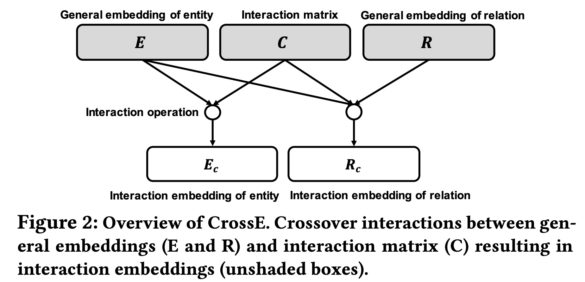
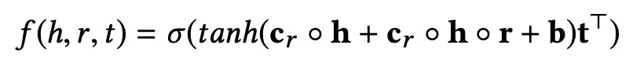
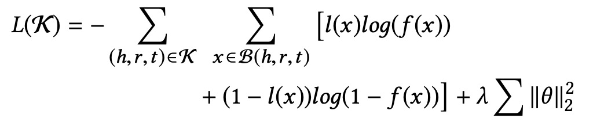
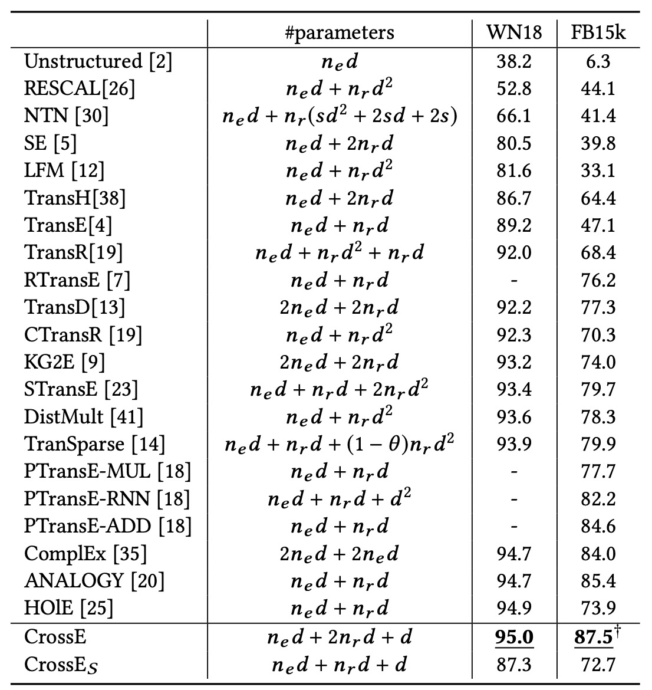

[**中文**](https://github.com/wencolani/CrossE/blob/master/README_CN.md) | [**English**](https://github.com/wencolani/CrossE/)

<p align="center">
    <a href="https://github.com/zjunlp/openue"> </a>
</p>

<p align="center">
    <strong>CrossE is a knowledge graph emebdding method proved to be good at providing explanations</strong>
</p>


This repository is the official introduction of **[Interaction Embeddings for Prediction and Explanation in Knowledge Graphs](https://dl.acm.org/doi/10.1145/3289600.3291014)** . This paper has been accepted by **WSDM 2019** main conference. 


# Brief Introduction


### Abstract

Knowledge graph embedding aims to learn distributed representations for entities and relations, and is proven to be effective in many applications. Crossover interactions — bi-directional effects between entities and relations — help select related information when predicting a new triple, but haven’t been formally discussed before. In this paper, we propose CrossE, a novel knowledge graph embedding which explicitly simulates crossover interactions. It not only learns one general embedding for each entity and relation as most previous methods do, but also generates multiple triple specific embeddings for both of them, named interaction embeddings. We evaluate embeddings on typical link prediction tasks and find that CrossE achieves state-of-the-art results on complex and more challenging datasets. Furthermore, we evaluate embeddings from a new perspective — giving explanations for predicted triples, which is important for real applications. In this work, an explanation for a triple is regarded as a reliable closed-path between the head and the tail entity. Compared to other baselines, we show experimentally that CrossE, benefiting from interaction embeddings, is more capable of generating reliable explanations to support its predictions.


### Model

CrossE is a knowledge graph embedding method in which each entity and relation is represented by multiple embeddings considering the crossover interaction between entities and relations: (1) a general embedding ppreserves high-level properties, (2) multiple interaction embeddings, which preserve specific properties as reasults of crossover interaction. Following is the overview of CrossE




Score function of CrossE is 



Loss function of CrossE is 




### Experiments

Following is result of Hit@10 on WN18 and FB15k dataset



## How to Cite

If you use or extend our work, please cite the following paper:

```
@inproceedings{crosse,
  author    = {Wen Zhang and
               Bibek Paudel and
               Wei Zhang and
               Abraham Bernstein and
               Huajun Chen},
  title     = {Interaction Embeddings for Prediction and Explanation in Knowledge
               Graphs},
  booktitle = {{WSDM}},
  pages     = {96--104},
  publisher = {{ACM}},
  year      = {2019}
}
```
