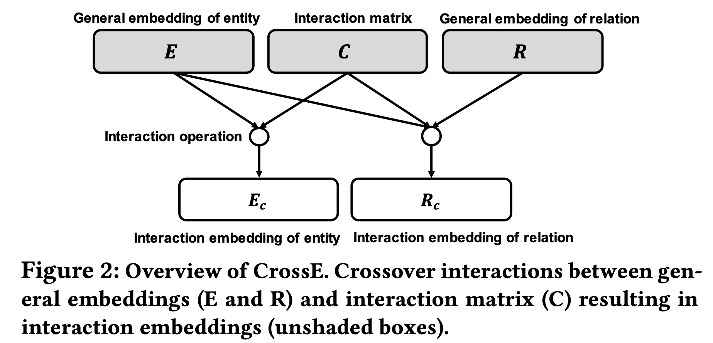
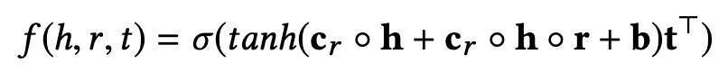

[**中文**](https://github.com/wencolani/CrossE/blob/master/README_CN.md) | [**English**](https://github.com/wencolani/CrossE/)


<p align="center">
    <a href="https://github.com/zjunlp/openue"> </a>
</p>

<p align="center">
  	<strong>CrossE是一个考虑了实体和关系交叉交互的知识图谱嵌入表示学习方法</strong>
</p>


# 论文简介


### 摘要

本文是我们与苏黎世大学合作的工作，将发表于WSDM2019，这篇工作在知识图谱的表示学习中考虑了实体和关系的交叉交互，并且从预测准确性和可解释性两个方面评估了表示学习结果的好坏。


### 模型

给定知识图谱和一个要预测的三元组的头实体和关系，在预测尾实体的过程中，头实体和关系之间是有交叉交互的crossover interaction, 即关系决定了在预测的过程中哪些头实体的信息是有用的，而对预测有用的头实体的信息又决定了采用什么逻辑去推理出尾实体，文中通过一个模拟的知识图谱进行了说明如下图所示：


基于对头实体和关系之间交叉交互的观察，本文提出了一个新的知识图谱表示学习模型CrossE. CrossE除了学习实体和关系的向量表示，同时还学习了一个交互矩阵C，C与关系相关，并且用于生成实体和关系经过交互之后的向量表示，所以在CrossE中实体和关系不仅仅有通用向量表示，同时还有很多交互向量表示。CrossE核心想法如下图：



在CrossE中，头实体的向量首先和交互矩阵作用生成头实体的交互表示，然后头实体的交互表示和关系作用生成关系的交互表示，最后头实体的交互表示和关系的交互表示参与到具体的三元组计算过程。对于一个三元组的计算过程展开如下：



### 实验

实验中本文首先用链接预测的效果衡量了表示学习的效果，实验采用了三个数据集WN18， FB15k, FB15k-237, 实验结果如下：


从实验结果中我们可以看出， CrossE实现了较好的链接预测结果。 我们去除CrossE中的头实体和关系的交叉交互，构造了模型CrossES，CrossE和CrossES的比较说明了交叉交互的有效性。


除了链接预测，我们还从一个新的角度评估了表示学习的效果，即可解释性。我们提出了一种基于相似结构通过知识图谱的表示学习结果生成预测结果解释的方法，并提出了两种衡量解释结果的指标，AvgSupport和Recall。Recall是指模型能给出解释的预测结果的占比，其介于0和1之间且值越大越好； AvgSupport是模型能给出解释的预测结果的平均support个数， AvgSupport是一个大于0的数且越大越好。可解释的评估结果如下：


从实验结果中我们可以看出，整体来说CrossE能够更好地对预测结果生成解释。


链接预测和可解释的实验从两个不同的方面评估了知识图谱表示学习的效果，同时也说明了链接预测的准确性和可解释性没有必然联系，链接预测效果好的模型并不一定能够更好地提供解释，反之亦然。


# 代码使用
### 环境要求

本项目是基于Tensorflow 1.X 版本开发的。

### 运行代码

请运行以下命令来训练和测试模型：

```训练
python3 CrossE.py --batch 4000 --data ../datasets/FB15k/ --dim 300 --eval_per 20 --loss_weight 1e-6 --lr 0.01 --max_iter 500 --save_per 20
```


# 如何引用

如果您使用或扩展我们的工作，请引用以下文章：

```
@inproceedings{crosse,
  author    = {Wen Zhang and
               Bibek Paudel and
               Wei Zhang and
               Abraham Bernstein and
               Huajun Chen},
  title     = {Interaction Embeddings for Prediction and Explanation in Knowledge
               Graphs},
  booktitle = {{WSDM}},
  pages     = {96--104},
  publisher = {{ACM}},
  year      = {2019}
}
```
